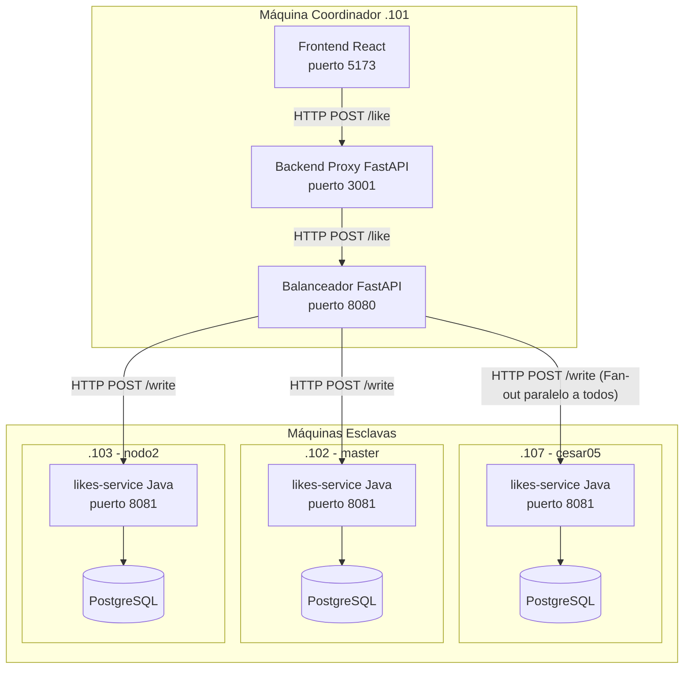

# Arquitectura del Sistema Distribuido (LikeCluster)

Este documento describe la arquitectura final del proyecto, cómo están divididos los componentes en la red y cómo fluye la información en este sistema de réplicas "leaderless" (sin líder) con cuórum.

---

## 1. Topología de Red y Roles

A continuación, un diagrama visual de cómo se conectan los componentes físicos y lógicos:

El sistema está distribuido en 4 máquinas físicas en una red local (LAN). Se divide en dos roles principales:

### El Coordinador (Máquina `.101` - `cesar-Thin-GF63-12VE`)
Esta máquina es la "puerta de entrada" del sistema y no guarda datos. Contiene los componentes visuales y el enrutador principal:
* **Frontend (`demo-webapp/frontend`)**: Aplicación React (Vite) en el puerto `5173`.
* **Backend Proxy (`demo-webapp/backend`)**: Aplicación FastAPI en Python (puerto `3001`). Simplemente sirve los datos estáticos de los posts y reenvía los clics al balanceador para evitar problemas de CORS en el navegador.
* **Balanceador-Coordinador (`balanceador-coordinador`)**: El cerebro del enrutamiento. Aplicación FastAPI en Python (puerto `8080`). Sabe de la existencia de los esclavos, verifica si están vivos y decide a quién mandarle la información.

### Los Esclavos o Nodos (Máquinas `.107`, `.102`, `.103`)
Son los obreros del sistema. Tienen las bases de datos y procesan la lógica de negocio.
* **Microservicio Java (`likes-service`)**: Desarrollado en Java 21 con Spring Boot 3.2.x (puerto `8081`). Recibe peticiones de lectura/escritura y guarda la información.
* **Base de Datos Independiente**: Cada esclavo tiene **su propia instalación de PostgreSQL** completamente aislada (BD `likesdb`). No comparten disco, ni memoria, ni conexión a BD. Es un esquema *Shared Nothing*.

---

## 2. Flujo de Comunicación (El ciclo de vida de un Like)

Cuando un usuario entra a la interfaz web y hace clic en "Like", el viaje de ese clic es el siguiente:

1. **Frontend (React)** ➔ `POST http://192.168.0.101:3001/like` (Hacia el Backend Proxy).
2. **Backend Proxy** ➔ `POST http://localhost:8080/like` (Reenvía al Balanceador).
3. **Balanceador-Coordinador**:
   - Revisa su lista interna para ver qué esclavos están "vivos" (estado `CLOSED` del Circuit Breaker).
   - El sistema exige un **Cuórum de Escritura (W=2)**. El balanceador hace un **Fan-out paralelo** (envía la petición HTTP `POST /write` al mismo tiempo a **todos** los nodos activos).
4. **Nodos (Java)**:
   - Todos los nodos sanos reciben el `POST /write` casi simultáneamente.
   - Generan una transacción atómica local: insertan el ID del like en una tabla histórica (`wal_log`) y suman +1 al contador total del post en la tabla `likes`.
   - Si el *like_id* ya existía en ese nodo, se rechaza silenciosamente (Idempotencia) garantizando que no se cuenten likes dobles por errores de red.
   - Responden `200 OK` al Balanceador.
5. **Balanceador-Coordinador** ➔ Apenas recibe confirmación de **al menos 2 nodos** (cumpliendo `W=2`), da por exitosa la operación y cancela la espera del tercero, respondiendo `200 OK` al Backend Proxy.
6. **Backend Proxy** ➔ Responde `200 OK` al Frontend.
7. **Frontend (React)** ➔ Pinta el corazón de rojo.

---

## 3. Resiliencia, Tolerancia a Fallos y Sincronización

¿Qué pasa si desconectamos el cable de red del Nodo 3 (`.103`)?

### El Circuit Breaker (Cortacircuitos)
El Balanceador está todo el tiempo enviando un latido (`GET /health`) a los 3 nodos. Cuando el Nodo 3 se apaga:
1. El latido falla. Tras 3 fallos consecutivos, el Balanceador marca al Nodo 3 como `OPEN` (muerto).
2. El sistema sigue funcionando perfectamente porque aún quedan vivos el Nodo 1 y el Nodo 2 (suficientes para cumplir `W=2` y `R=2`). El usuario final nunca nota la caída.

### La Resincronización (Recovery / Catch-up)
Horas más tarde, el Nodo 3 vuelve a encenderse. Durante el tiempo que estuvo apagado, se perdió miles de Likes.
1. Al arrancar Spring Boot, arranca un hilo en segundo plano (`ResyncRunner.java`).
2. El Nodo 3 le pregunta a sus pares (Nodos 1 y 2): *"Pasame tu registro histórico (WAL) a partir del punto donde me quedé"*.
3. El Nodo 3 se descarga los likes faltantes y los aplica uno a uno en su propia base de datos PostgreSQL, recalculando los contadores.
4. El Balanceador, al ver que el Nodo 3 ya responde los latidos (`HALF_OPEN`) y que sus números se han nivelado con el resto, lo marca de nuevo como `CLOSED` (sano) y vuelve a mandarle tráfico real.

---

## 4. Estructura de las Bases de Datos (PostgreSQL)

Cada nodo es dueño absoluto de su base de datos. La estructura de tablas (creada automáticamente por Spring Boot al arrancar) es:

- **`likes` (Contadores consolidados)**
  - `post_id` (PK, string)
  - `count` (entero, total de likes)
- **`wal_log` (Write-Ahead Log / Registro Histórico)**
  - `seq` (BIGSERIAL, número único por registro)
  - `post_id` (string)
  - `like_id` (string)
  - *Índice único sobre `(post_id, like_id)` para garantizar la idempotencia.*

---

## 5. Decisiones Clave de Diseño

1. **No hay Nodo Líder (Masterless/Leaderless)**: A diferencia de un sistema MySQL Replication donde hay un Master y varios Slaves, aquí todos los nodos Java son iguales (arquitectura tipo Cassandra o Dynamo). Cualquiera puede aceptar lecturas y escrituras.
2. **Cuórum Estricto**: `N=3`, `W=2`, `R=2`. Al escribir en 2 y leer de 2, el sistema siempre garantiza devolver el dato más fresco, previniendo lecturas "viejas" o inconsistentes (Stale reads).
3. **Persistencia por WAL**: Al registrar la historia de operaciones antes de alterar el contador, se hace trivial que un nodo recupere el estado tras una caída, en lugar de intentar copiar tablas enteras.
